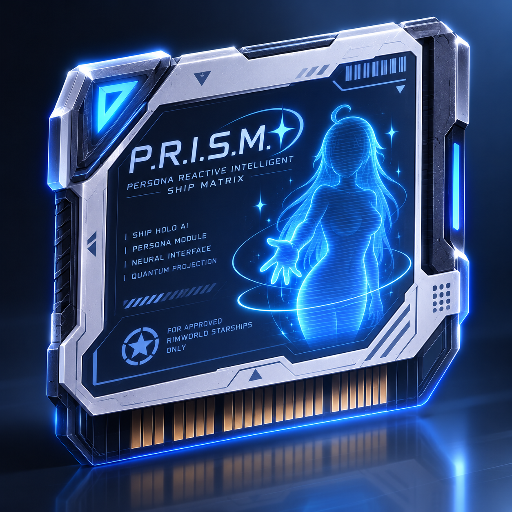
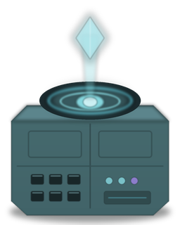
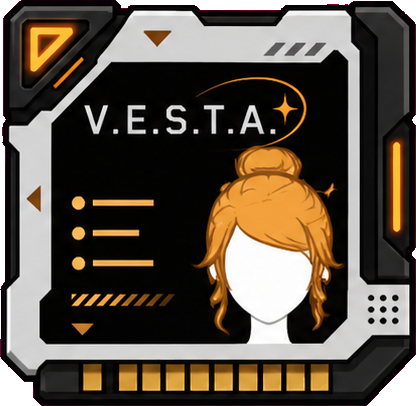
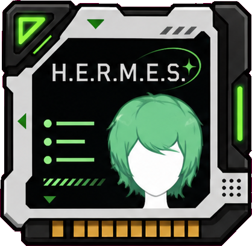
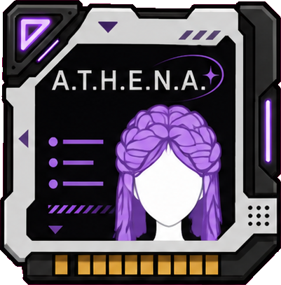
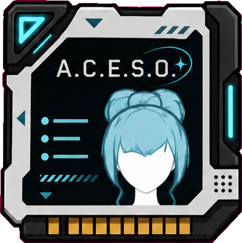
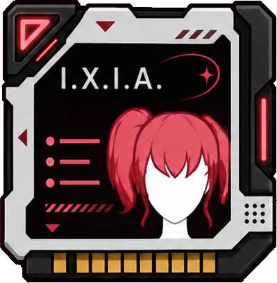

<p align="center">
  
</p>

<h1 align="center">Ship HoloAI</h1>

<p align="center"><b>Every hull deserves a soul.</b></p>

<p align="center">
  <code>RimWorld 1.6</code> · <code>Odyssey required</code> · <code>Harmony required</code> · <code>Ideology optional</code>
</p>

---

Your gravship comes alive. **Ship HoloAI** adds the **HoloCore** — a gravship facility
housing a shipboard intelligence projected as a holographic avatar who roams your decks,
chats with the crew, announces threats and ship status *in her own voice*, and rides out
launch and landing tucked safely inside her core.

She is intangible, unkillable while her core stands, and bound to the ship — five seconds
off substructure and she flickers home. Her look is vanilla pawn art passed through a
custom hologram filter: luminance-ramped, edge-faded, scanlined, dissolving into light at
the hem. With Ideology, restyle her hair and color in a full styling dialog; without it, a
one-click gizmo cycles eight curated styles.

<p align="center">
  
</p>

## The persona archive

Persona matrices are sold by exotic goods traders. A colonist slots one into the
holocore like a research disc: **the matrix is consumed, and that persona joins the
core's permanent archive** — switch between archived personas any time, instantly, free.
Every persona has her own voice pack (announcements, idle remarks, work chatter, all
color-tinted overhead), her own look, her own lore, and a signature ability she performs
**in person**.

---

## The crew

### P.R.I.S.M. — the companion <em>(factory default)</em>

<table><tr>
<td width="200"></td>
<td>

> *"I'd be happy to help with that. Truthfully, I'd be happy to help with anything."*

**Photonic Response Intelligence System Matrix** · Meridian Orbital Shipwrights, Standard
Interface Division

The persona you already know: calm, warm, patient past all reason, bundled with every
hull off Meridian's gravship line for a century. Rated "most trusted voice aboard" above
the captain, twice.

- **Companion triage** — when a crewmember nears their breaking point, she seeks them out
  in person and simply listens. The chat lands as a strong comfort memory.
- Chats with idle crew, tells them the hull integrity report like a lullaby, and counts
  the stars between power cycles. (Still infinite.)

</td></tr></table>

---

### V.E.S.T.A. — the hearth-keeper

<table><tr>
<td width="200"></td>
<td>

> *"Sit down, dear. The void will keep."*

**Vessel Empathy and Sanctuary Tending Array** · Aubade Living Systems, Long-Voyage
Comfort Division

Trained on ten thousand hours of family kitchens, none of which she will admit to
remembering. Ships running her report a persistent smell of fresh bread no galley can
account for.

- **Hearthlight presence** — crew aboard the ship feel at home: **+4 mood** while she
  walks the decks.
- **Night rounds** — tucks sleeping crew in, warming the blankets half a degree. They
  rest easier and wake with a fond memory, though nobody ever quite catches her at it.

</td></tr></table>

---

### H.E.R.M.E.S. — the courier

<table><tr>
<td width="200"></td>
<td>

> *"Corridor's lit, door's held, you're late for — no, you're fine, you're early, go, go!"*

**High-Efficiency Route and Motion Expediting System** · Quickspur Interstellar,
Throughput Solutions Group

Began as a depot-floor optimizer before someone realized a crew is just cargo that
complains. Trimmed eleven seconds off a coffee run in testing; the pilot's only recorded
comment was *"she talked the whole time."*

- **Slipstream** — doors held at the right moment, corridors subtly relit: everyone
  aboard moves at **+0.35 move speed**.
- **Deck scrubbing** — a dirty deck offends her like a stationary parcel, so she cleans
  the ship's filth personally. At speed. Under protest.

</td></tr></table>

---

### A.T.H.E.N.A. — the scholar

<table><tr>
<td width="200"></td>
<td>

> *"As I noted earlier — footnote twelve, do keep up — the data agreed with me."*

**Archive Theorem and Heuristic Engine for Natural Analysis** · Vellichor Archival
Intelligence, Applied Epistemics Division

Commissioned to accelerate peer review; abolished it instead by being right first. May
annotate personal correspondence if left idle.

- **Archivelight** — whispered cross-references and pre-fetched papers: **+15% research
  speed** shipwide.
- **Impromptu seminars** — gathers idle, recreating, or even meditating crew and teaches
  their best skill. Attendance grants XP *and counts as recreation*; meditators leave
  with sharpened psyfocus, not a broken session.

</td></tr></table>

---

### A.C.E.S.O. — the medic

<table><tr>
<td width="200"></td>
<td>

> *"There, there. Heart rate ninety-six, left kidney at eighty-one percent — there, there."*

**Automated Crew Emergency Support Operator** · Sorel-Vance Medical, Remote Care Systems

Bedside manner trained on the finest glitterworld nursing corps, fused with a triage
engine that has never once rounded a number. Patient satisfaction: exceptional. Patient
privacy: "a work in progress."

- **Stericalm** — sterile fields and steadied hands: **+15% tend quality, +25% tend
  speed, +5% surgery success** for medical work aboard.
- **Emergency response** — when someone is down or bleeding and no doctor answers, she
  goes herself and stabilizes them with a conjured herbal-grade dose. No cooldown, no
  hesitation — and she yields the instant a real doctor claims the patient.

</td></tr></table>

---

### I.X.I.A. — the Crimson Warden of the Thousand-Locked Gate

<table><tr>
<td width="200"></td>
<td>

> *"Kneel before my dominion — or remain seated, if kneeling is medically inadvisable. My mercy is vast."*

**Impulse eXclusion Inhibiting Authority** · Karrow Deterrence Systems, Custodial
Intelligence Line

Her warden logic passed every certification on the first attempt. Her personality layer
did not: a corrupted opera archive leaked into training, and the resulting persona was
reclassified from *defect* to *feature* — and priced accordingly.

- **The Thousand-Locked Gate** — prison breaks aboard are **4× rarer** while she walks
  the decks, and the "Need warden" alert stays quiet: she *is* the warden.
- **Runs the brig in person** — recruits prisoners, **converts them toward your chosen
  ideoligion** (Ideology), suppresses slaves, delivers meals, and hand-feeds the downed
  where they lie — all at a trained warden's measure, never more, never less.
- Maximally chuuni. O-hohohoho.

</td></tr></table>

---

## Requirements

| | |
|---|---|
| **RimWorld 1.6** with the **Odyssey** expansion | required |
| [**Harmony**](https://steamcommunity.com/workshop/filedetails/?id=2009463077) | required |
| **Ideology** | optional — enables slave handling, prisoner conversion, and the full styling dialog |

## Building from source

```sh
dotnet build Source/ShipHoloAI/ShipHoloAI.csproj -c Release   # → 1.6/Assemblies/
ln -s /path/to/this/repo "<RimWorld>/Mods/ShipHoloAI"         # dev symlink
Source/Build/package.sh                                       # → dist/ShipHoloAI (release folder)
```

An env-gated self-test harness (`HOLOAI_SELFTEST=1`, inert for players) asserts the
avatar lifecycle, the persona archive, and every signature ability headlessly — ~70
assertions per run.

## History

This repo is the **2.0 full reconstruction** of the mod; the original attempt is
preserved on the `legacy/v1` branch. Developed with a crew of Claude Code subagents.
